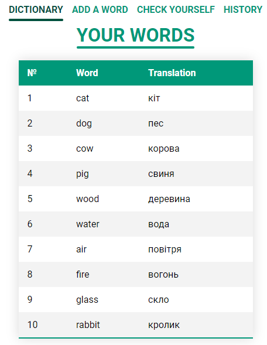

# Word learning

## About

The main idea is that the user enters some words and their translation, 
the user enters a certain number of words into the dictionary 
and then can check whether he remembers them.

[DEMO LINK](https://twoandmore.github.io/word-learning/)

## Preview



## How to work with. Steps:

1. Download or clone repository. `git clone https://github.com/TwoAndMore/word-learning.git`.
2. Open project folder with code editor (VS Code, WebStorm, other).
3. Run ```npm install``` in terminal.
4. Open second terminal and run ```npm start```.
5. If tab does not open, go to ```http://localhost:3000``` in your browser.
